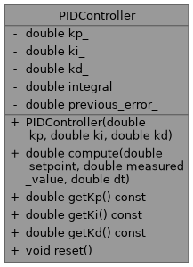

# enpm700_test_driven_development_exercise

# Badges
 [](https://codecov.io/gh/mdevhurt1/enpm700_test_driven_development_exercise) [](LICENSE)

# Authors

## Part 1

- Marcus Hurt (`mdevhurt1`) - Driver, Navigator

## Part 2

- Venkata Madhav Tadavarthi (`madhav2133`) - Driver
- Rahul Kumar (`rahulk-99`) - Navigator

# UML Diagram


<!-- # Future Work
The file in libs/pid_controller pid_controller.cpp contains stubs for the implementation of the PID class. There are inline TODO comments for the work that is needed.

## Inline TODOs in `pid_controller.cpp`
- Implement constructor logic to initialize PID gains and internal state.
- Implement `compute()` method for PID control logic.
- Implement getter methods: `getKp()`, `getKi()`, `getKd()`.
- Implement setter methods: `setKp()`, `setKi()`, `setKd()`.
- Implement `reset()` method to clear internal state (integral, previous error). -->

### Project Structure
The project uses:
- CMake for build management
- GoogleTest for unit testing
- Doxygen for documentation

### Basic Installation and Setup
```bash
# Clone the repository
git clone https://github.com/mdevhurt1/enpm700_test_driven_development_exercise.git
cd enpm700_test_driven_development_exercise

# Configure and build the project
cmake -S ./ -B build/
cmake --build build/

```

### Implementation
The PID controller implementation consists of:
- Header (`libs/pid_controller/pid_controller.hpp`): Class declaration with gains (kp, ki, kd)
- Source (`libs/pid_controller/pid_controller.cpp`): Implementation returning constant value

To run the implementation:
```bash
./build/app/shell-app
```

### Testing
The project includes unit tests for the PID controller in `test/pid_test.cpp`:
- Stub implementation verification
- Constructor initialization test
- Edge cases testing (zero, large, negative velocities)

To run the tests:
```bash
./build/test/cpp-test
```