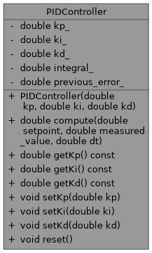

# enpm700_test_driven_development_exercise

# Badges
  

# Authors

## Part 1

- Marcus Hurt (`mdevhurt1`) - Driver, Navigator

# UML Diagram

# Future Work
The file in libs/pid_controller pid_controller.cpp contains stubs for the implementation of the PID class. There are inline TODO comments for the work that is needed.

## Inline TODOs in `pid_controller.cpp`
- Implement constructor logic to initialize PID gains and internal state.
- Implement `compute()` method for PID control logic.
- Implement getter methods: `getKp()`, `getKi()`, `getKd()`.
- Implement setter methods: `setKp()`, `setKi()`, `setKd()`.
- Implement `reset()` method to clear internal state (integral, previous error).